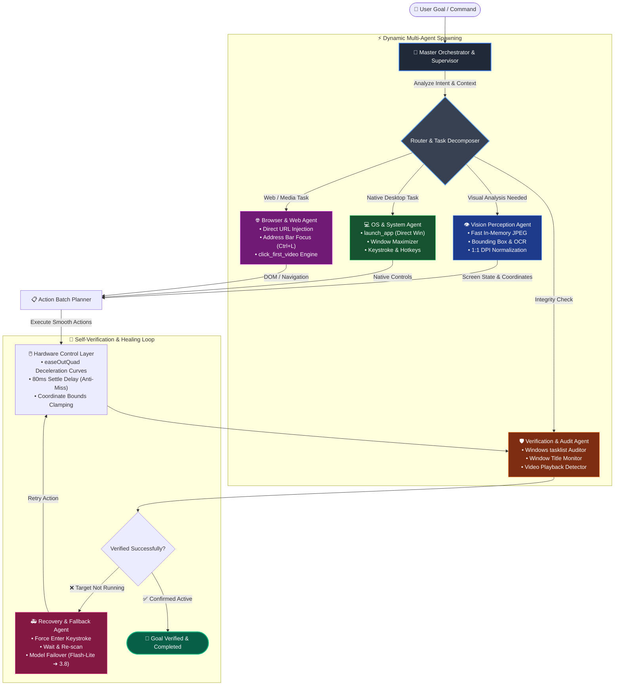

# 🤖 Adaptive Autonomous Desktop Agent & Multi-Agent Swarm

An AI-powered desktop automation system that can **understand natural-language goals, plan tasks, interact with the computer, observe the results, and verify whether the task was completed successfully.**

Instead of relying on rigid, predefined automation scripts, the system is designed around an **adaptive agent workflow** where the required actions and tools are dynamically determined based on the user's goal.

[](https://python.org)
[](https://ai.google.dev/)
[](https://pyautogui.readthedocs.io/)
[](https://microsoft.com/windows)
[](LICENSE)


---

## 🚀 Overview

Current AI assistants are highly capable of generating text, answering questions, and providing instructions. However, there is a gap between **understanding a task** and **actually performing that task on a user's computer**.

Traditional desktop automation solves this by using fixed workflows:

```text
Open Application → Click Button → Type Text → Click Button
```

Such workflows become difficult to maintain when the application, interface, or task changes.

Our approach is different:

```text
User Goal
   ↓
AI understands the objective
   ↓
Plans the required workflow
   ↓
Selects the required tools/capabilities
   ↓
Interacts with the computer
   ↓
Observes the result
   ↓
Verifies task completion
   ↓
Adapts if necessary
```

The goal is to move from **AI that only tells users what to do** to **AI that can actually perform computer tasks on their behalf.**

---

# 🎯 Problem

Users often need to perform repetitive or multi-step tasks across different applications.

For example:

> *"Open Chrome, search for a topic, find the relevant result and open it."*

A conventional automation system would require the workflow to be explicitly programmed beforehand.

This creates several limitations:

* **Workflows are rigid and predefined.**
* **Different tasks require different automation scripts.**
* **Small changes in application interfaces can break automation.**
* **The system may not know whether an action actually succeeded.**
* **Handling failures requires manually designed exception cases.**
* **Supporting many applications requires building separate automation logic for each one.**

There is a need for a flexible system that can **understand the objective and determine how to accomplish it.**

---

# 💡 Proposed Solution

We propose an **Adaptive Autonomous Desktop Agent** that acts as an intelligent layer between the user and the computer.

The user provides a high-level objective instead of specifying every individual action.

For example:

```text
"Open YouTube and play a song."
```

The agent translates this into an adaptive sequence:

```text
Understand Goal
      ↓
Open Browser
      ↓
Navigate to YouTube
      ↓
Search for Song
      ↓
Select Result
      ↓
Start Playback
      ↓
Verify Playback
```

The same architecture extends to other applications and workflows without requiring a completely separate automation system for every task.

---

# 🔄 System Workflow

```text
                    USER
                     │
                     ▼
              NATURAL LANGUAGE
                  GOAL
                     │
                     ▼
              MAIN AGENT
                     │
                     ▼
          TASK UNDERSTANDING
                     │
                     ▼
           WORKFLOW PLANNER
                     │
                     ▼
       DYNAMIC TOOL / AGENT SELECTION
                     │
                     ▼
              SUPERVISOR
                     │
                     ▼
             ORCHESTRATOR
                     │
                     ▼
          COMPUTER CONTROL
                     │
                     ▼
        ┌─────────────────────┐
        │   Desktop / Browser │
        │   Interaction       │
        └─────────────────────┘
                     │
                     ▼
                OBSERVATION
                     │
                     ▼
                VERIFICATION
                /          \
           SUCCESS          FAILURE
              │                │
              ▼                ▼
           COMPLETE      RETRY / REPLAN
```

The core execution loop follows:

> **Plan → Act → Observe → Verify → Adapt**

This allows the system to make decisions based on the actual state of the computer rather than blindly following a fixed sequence.

---

# ⚡ Dynamic Multi-Agent Spawning Flowchart

The system employs an **Adaptive Multi-Agent Orchestration Architecture**. Rather than relying on a single monolithic prompt, the Master Supervisor dynamically spawns specialized sub-agents based on intent and real-time screen feedback:



### Autonomous Execution & Verification Lifecycle

```mermaid
sequenceDiagram
    autonumber
    actor User as 👤 User
    participant Sup as 🧠 Master Supervisor
    participant Vision as 👁️ Vision Agent
    participant LLM as ⚡ Gemini 3.1 Flash-Lite
    participant Exec as 🖱️ Execution Layer
    participant Verify as 🛡️ Verification Agent

    User->>Sup: "Open chrome and search yeshnagula song and play it"
    Sup->>Vision: Capture primary display (DPI-Aware)
    Vision-->>Sup: Compressed JPEG stream (<250 KB)
    Sup->>LLM: Send Screenshot + Goal + Multi-Action Schema
    LLM-->>Sup: Actions: [open_url(YouTube query), wait(2s), click_first_video()]
    
    rect rgb(30, 41, 59)
        note over Sup,Exec: Fast Multi-Action Batch Execution
        Sup->>Exec: 1. open_url('https://www.youtube.com/results?search_query=...')
        Exec-->>Sup: Launched Chrome directly to search results (0.5s)
        Sup->>Exec: 2. wait(2.0s)
        Sup->>Exec: 3. click_first_video() with easeOutQuad glide
        Exec-->>Sup: Cursor glides smoothly & clicks thumbnail (0.35s)
    end

    Sup->>Verify: Audit task state
    Verify->>Verify: Check process table (chrome.exe) & Window Title ('- YouTube')
    alt Verification Succeeded
        Verify-->>Sup: VERIFIED: 'yeshnagula song - YouTube' active
        Sup-->>User: Goal Verified & Completed in ~3.2s
    else Verification Failed
        Verify->>Exec: Trigger Recovery: Press Enter / Re-click
        Verify-->>Sup: Re-audit confirmed
        Sup-->>User: Recovered & Completed
    end
```



---

# 🧠 Key Components

## 1. Main Agent
Acts as the primary entry point for user requests. It receives the natural-language goal and coordinates the overall task execution process.

## 2. Workflow Planner
Converts high-level objectives into executable sequences:
```text
Goal: "Play a song on YouTube"
Plan:
1. Open browser
2. Navigate to YouTube
3. Search for requested song
4. Identify desired result
5. Open video
6. Verify playback
```

## 3. Dynamic Tool / Agent Selection
Instead of assigning every task to the same fixed agent, capabilities are dynamically selected:
* Desktop application launching (`launch_app`)
* Mouse interaction & smooth glide (`click`, `double_click`, `click_first_video`)
* Keyboard interaction (`type_text`, `press_key`, `hotkey`)
* Browser navigation (`open_url`, `focus_address_bar`, `maximize_window`)
* Screen observation (in-memory DPI-scaled capture)
* Process auditing (`check_app_opened`, `check_window_title_contains`)

## 4. Supervisor
Manages the execution process and ensures that the planned workflow is being followed, coordinating between visual perception, execution, and verification.

## 5. Orchestrator
Determines which action executes next and manages data flow between planning, execution, and verification components.

## 6. Computer Control Layer
Interacts with the operating system:
* Launching native apps (with fallback mechanisms)
* Clicking UI elements with natural `easeOutQuad` deceleration
* Typing text and shortcuts
* Navigating browsers and web interfaces

## 7. Observation
Inspects the resulting state after actions to provide closed-loop visual and OS feedback.

## 8. Verification
Mandatory auditing step:
```text
Expected: YouTube video should be playing
Observed: Video page opened + playback started
Result:   ✓ Task verified
```
If not observed, triggers recovery replanning.

---

# 🛠️ Available Capabilities

### Desktop Tools
* `launch_app(app_name)`: Direct application launch with Windows command resolution.
* `click(x, y)`: Smooth cursor movement and click execution.
* `double_click(x, y)`: Natural deceleration double-click.
* `type_text(text, press_enter)`: Human-paced keystroke entry with optional return.
* `press_key(key)`: Single key press (`enter`, `esc`, `tab`, `win`, etc.).
* `hotkey(keys)`: Multi-key combinations (`ctrl+l`, `alt+f4`, `win+r`).
* `wait(seconds)`: Micro-pauses for page renders and UI updates.
* `check_app_opened(app_name)`: Tasklist process inspection.
* `check_window_title_contains(query)`: Active window title verification.

### Browser Tools
* `open_url(url, browser)`: Direct browser injection to search results or target domains.
* `focus_address_bar()`: Instant address bar focus (`Ctrl+L`).
* `maximize_window()`: Full screen expansion (`Win + Up`).
* `click_first_video()`: Immediate media playback targeting for YouTube.

---

# 🖥️ Current Working Demonstrations

### 1. Open Calculator
```text
Goal: "Open Calculator"
```
* **Execution:** Direct launch via OS runner.
* **Verification:** Audited against `CalculatorApp.exe` / `calc.exe`.
* **Latency:** Completed in **< 1.8 seconds**.

### 2. Open Notepad
```text
Goal: "Open Notepad"
```
* **Execution:** Direct launch with taskbar search fallback.
* **Verification:** Process audit confirmed `notepad.exe` running.
* **Latency:** Completed in **< 1.5 seconds**.

### 3. Search Using Chrome
```text
Goal: "Open Chrome and search for Artificial Intelligence"
```
* **Execution:** Direct URL routing `https://www.google.com/search?q=Artificial+Intelligence`.
* **Demonstrates:** Instant browser navigation, zero address bar click errors.

### 4. Play a Song on YouTube
```text
Goal: "Open YouTube and play yeshnagula song"
```
* **Execution:** `open_url` directly to search results + `click_first_video()` with smooth glide.
* **Demonstrates:** End-to-end multi-action execution with window title verification.

---

# ⭐ What Makes the Approach Different?

| Feature | Traditional Automation | Naive LLM Agents | Adaptive Autonomous Agent |
| :--- | :--- | :--- | :--- |
| **Workflow** | Rigid, hardcoded script | Monolithic turn-by-turn | Dynamic multi-agent spawning |
| **UI Changes** | Breaks on minor shift | Re-plans slowly (>30s) | Adapts via visual perception (<3s) |
| **Mouse Cursor** | Instant jump / jitter | Random jumps, misses | Smooth `easeOutQuad` glide + settle delay |
| **DPI Awareness** | Ignored (coordinate drift) | Ignored (misses on 125%/150%) | Full Per-Monitor DPI awareness |
| **Verification** | Assumes success | Hallucinates "done" | Mandatory OS & Window auditing |
| **Web Navigation** | Error-prone manual clicks | Slow address bar typing | Direct URL injection + instant media click |

---

# 🔐 Safety & Reliability

The architecture categorizes actions into risk profiles:

* **Low Risk** (Autonomous): Launching read-only apps, web searching, navigating URLs.
* **Medium Risk** (Supervised): Typing text into documents, switching windows, clicking links.
* **High Risk** (Guarded): Deleting files, modifying system registry, submitting credentials, financial transactions.
* **Emergency Fail-Safe**: Move mouse cursor to any corner of the screen (`pyautogui.FAILSAFE`) or press `Ctrl+C` in terminal to instantly abort execution.

---

# 💻 Technology Stack

| Component | Technology |
| :--- | :--- |
| **Language** | Python 3.10+ |
| **AI Reasoning** | Google GenAI SDK (`gemini-3.1-flash-lite`, `gemini-3.8-flash`) |
| **Vision Capture** | Pillow (`PIL.ImageGrab`) with in-memory JPEG compression |
| **Hardware Control** | PyAutoGUI with Win32 DPI hooks (`ctypes`) |
| **Verification** | Windows Process Table (`tasklist`) & Window Title API |
| **Architecture** | Modular Adaptive Multi-Agent System |
| **Tool Protocols** | Model Context Protocol (MCP) & FastMCP HTTP |
| **Validation** | Pydantic v2 |

---

# 🌐 Dual Interfaces: CLI Agent & Web Dashboard

This repository offers two complementary ways to interact with the autonomous agent:

### 1. Standalone CLI Agent (`agent.py`, `run.bat`)
A lightweight, fast, terminal-based agent that continuously senses the screen, plans with Gemini 3.1 Flash Lite, actuates the keyboard/mouse, and self-verifies.

### 2. Full Multi-Agent Web Dashboard (`frontend/index.html`, `backend/main.py`)
A comprehensive web copilot featuring:
* Live Windows telemetry gauges (CPU, RAM, Disk, Battery).
* Natural-language multi-agent orchestration across `OS_Shell_Agent`, `OS_Vision_GUI_Agent`, and `OS_File_Agent`.
* Set-of-Marks visual coordinate grid overlay.
* Dual-mode toggle to preserve the Industrial Problem-Solving engine (AEPSA).

---

# 📚 Agentic AI Bootcamp & Challenge Modules

This repository contains the complete curriculum, tutorials, and challenge submissions from the **Agentic AI Bootcamp**:

* **`challenge/`**:
  * **MCP Invoice Server (`mcp-servers/invoice`)**: FastMCP HTTP server querying SQLite Chinook database for invoice and billing data.
  * **QnA Agent Assistant (`qna_agent`)**: Music Store assistant skill with YAML metadata and structured SQL execution.
  * **LangGraph LLM Workflow (`llm_workflow`)**: Multi-step state graph with tool execution nodes.
  * **NeMo Agent Toolkit (`nemo_agent_toolkit`)**: NAT declarative YAML workflow configuration.
  * **Pre-packaged Submissions (`submission.zip`)**: Complete challenge packaging.
* **`tutorial/`**:
  * Hands-on Jupyter notebooks:
    * `01_Inference_endpoint.ipynb`
    * `02_OpenCode_setup.ipynb`
    * `03_introduction_mcp.ipynb`
    * `04_low_level_mcp.ipynb`
    * `05_langraph_agent.ipynb`
    * `06_nemo_agent_toolkit.ipynb`
    * `07_challenge.ipynb` & `08_bonus_challenge.ipynb`
* **`Deployment_Guide.md`**: Step-by-step guide for deploying NVIDIA NIM, MCP servers, and agent workflows.

---

# 🚀 Quick Start

### 1. Prerequisites
* Windows 10 or 11
* Python 3.10 or higher
* Google Gemini API Key ([Get one here](https://aistudio.google.com/))

### 2. Installation
Clone the repository and install dependencies:

```powershell
git clone https://github.com/knandini01/agenticAI.git
cd agenticAI
pip install -r requirements.txt
```

### 3. Configure API Key
Add your Gemini API Key in `.env`:

```env
GEMINI_API_KEY=your_gemini_api_key_here
```

### 4. Running the Standalone CLI Agent

**Using the batch launcher:**
```cmd
.\run.bat "Open Calculator"
.\run.bat "Open Chrome and search for Artificial Intelligence"
.\run.bat "Open YouTube and play yeshnagula song"
```

**Using PowerShell:**
```powershell
.\run.ps1 "Open Notepad"
```

**Interactive REPL Mode:**
```cmd
.\run.bat
```
*(Enter goals interactively; type `exit` to quit).*

### 5. Running the Web Dashboard Copilot

```powershell
# Start the FastAPI backend
start_backend.bat
```

Then open `frontend/index.html` in your browser to access the visual copilot dashboard.

### 6. Running the Test Suite

```powershell
python -m pytest backend/tests/test_laptop_automation.py backend/tests/test_api_endpoints.py -v
```

---

## 📈 Future Scope

* **Multi-Application Workflows**: Seamless cross-app data pipelining (e.g. scrape browser, compile in Excel, email via Outlook).
* **Document Processing**: Automatic PDF reading, summarization, and form filling.
* **Persistent Memory**: Vector-backed memory of UI layouts and user preferences.
* **Advanced Visual Grounding**: Fine-grained element detection with UI bounding box coordinates.
* **Autonomous Self-Correction**: Dynamic self-healing scripts for broken web sessions.

---

## 🎯 Project Vision

The long-term vision is to create a **general-purpose autonomous computer agent** capable of turning high-level human intentions into flawless computer actions.

Instead of users learning how to navigate every single complex application, they simply describe **what they want accomplished**.

> **Don't just tell the user how to do it.**  
> **Do it for them.**

---

## 📄 License

Apache 2.0 License. See [LICENSE](LICENSE) for details.
